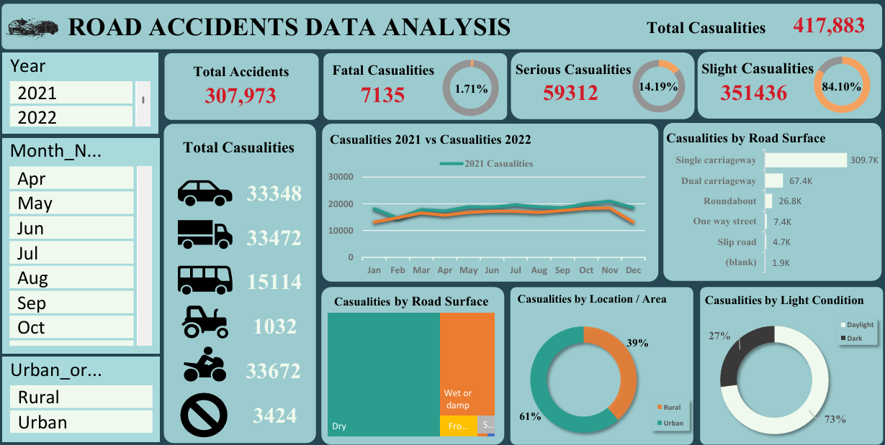

# 🚨 Road Accidents Data Analysis Dashboard

## 📝 Project Overview
This dashboard provides insights into road accidents based on multiple factors such as **time, location, severity, weather, and road conditions**.  
The goal is to identify patterns, high-risk conditions, and accident hotspots to support **data-driven decisions for road safety improvements**.

---

## 📊 Dataset Columns
The dataset contains the following fields:

| Column | Description |
|--------|-------------|
| Accident_Index | Unique accident identifier |
| Accident Date | Date of accident |
| Day_of_Week | Day on which accident occurred |
| Month_Name | Month of accident |
| Year | Year of accident |
| Junction_Control | Type of junction control (if any) |
| Junction_Detail | Details of the junction type |
| Accident_Severity | Fatal, Serious, or Slight |
| Latitude / Longitude | Geographic location of accident |
| Light_Conditions | Daylight, dark, lit, or unlit conditions |
| Local_Authority_(District) | District where accident occurred |
| Carriageway_Hazards | Hazards present on the road |
| Number_of_Casualties | Total casualties in the accident |
| Number_of_Vehicles | Vehicles involved |
| Police_Force | Police force jurisdiction |
| Road_Surface_Conditions | Dry, wet, icy, etc. |
| Road_Type | Type of road (single carriageway, dual, roundabout, etc.) |
| Speed_limit | Speed limit of the road section |
| Time | Time of the accident |
| Urban_or_Rural_Area | Location category (urban vs rural) |
| Weather_Conditions | Weather at the time of the accident |
| Vehicle_Type | Type of vehicle involved |

---

## 🎯 Key KPIs
- 🚦 **Total Accidents:** 307,973  
- ⚰️ **Total Casualties:** 417,883  
- 💀 **Fatal Accidents %:** 1.7%  

---

## 🔍 Key Insights

### 📈 Overall Accident & Casualty Trends
- Fatal Casualties: 7,135 (1.7%)  
- Serious Casualties: 59,312 (14.2%)  
- Slight Casualties: 351,436 (84.1%)  

### 📅 Yearly & Monthly Trends
- Seasonal patterns repeat consistently, peaking mid-year and dropping in December.  

### 🚗 Vehicle Type Impact
- Cars & goods vehicles: ~33K casualties each  
- Motorcycles: ~33.6K casualties → high vulnerability  
- Pedestrians: fewer in number but high severity risk  

### 🛣️ Road Conditions
- **Road Surface:** Dry roads dominate, wet/damp follow, icy/frosty less frequent but more dangerous  
- **Road Type:** Single carriageways (~310K casualties) are riskiest, dual (~67K) and roundabouts (~27K) safer  

### 🌍 Location
- Urban areas: 61% of casualties  
- Rural areas: 39%  

### 💡 Light Conditions
- Daylight accidents: 73%  
- Dark conditions: 27%  

---

## 📝 Key Takeaways
1. 🛣️ Focus safety improvements on single carriageways  
2. 🌆 Urban areas & daylight hours see the most accidents → linked to traffic density  
3. 🏍️ Motorcyclists disproportionately affected → stricter safety enforcement needed  
4. 📊 Casualty trends are stable year-on-year → indicates structural issues  
5. ☀️ Most accidents occur in normal/dry conditions → driver behavior & congestion are bigger risks  

---

## 🎨 Design & Theme
- 🖤 **Background:** Navy Blue (#264653)  
- 🔹 **Graph Panels:** Light Blue (#A8DADC)  
- ❤️ **Highlight Numbers:** Crimson (#E63946)  
- 🖊️ **Text:** Black (#000000)  
- 🌟 **Accent Colors:** Amber (#F4A261), Teal (#2A9D8F)  

---

> 💡 Dashboard Preview:

✅ **Tip:** Keep `road_accidents_dashboard.png` in your repo to provide a visual preview of the dashboard.  
